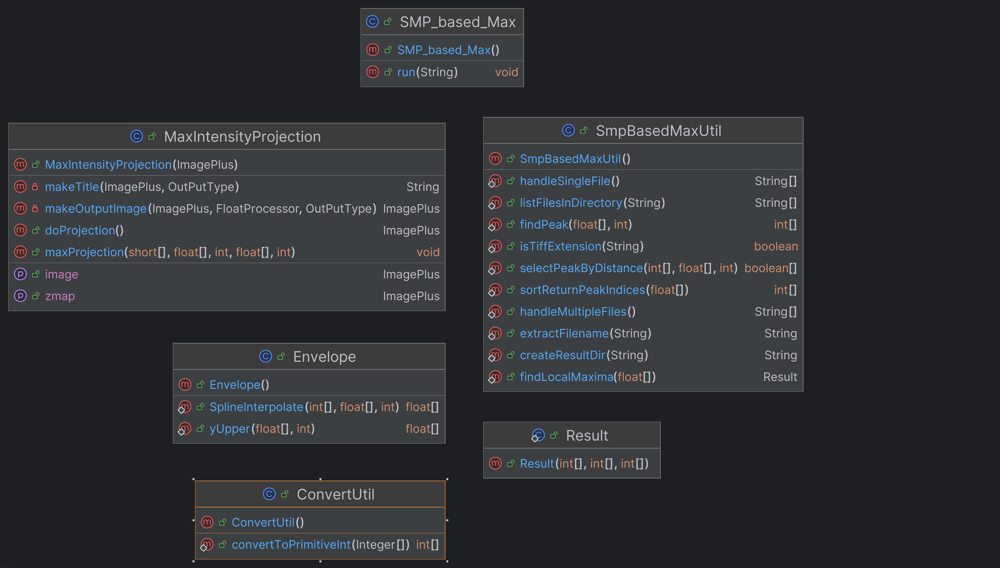

# Smooth Manifold based Maximum Intensity Projection

## Project Classes Overview:
[]

**SMP_based_Max**: Main class for the plugin, handle UI related processes.

**MaxIntensityProjection**: custom class to perform MIP on Image Stack, return projected Image and the z-map

**Envelope**: to obtain the upper and lower peak evelopes of signal

**SmpBasedMaxUtil**: class contains static functions to handle file input output, signal peak detection

**ConvertUtil**: class contains static functions for conversion of data type