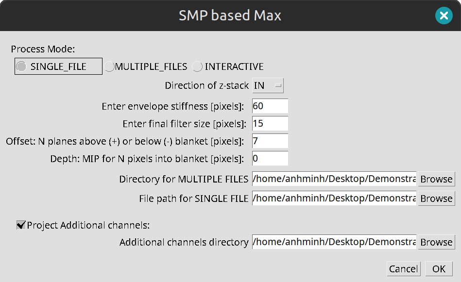
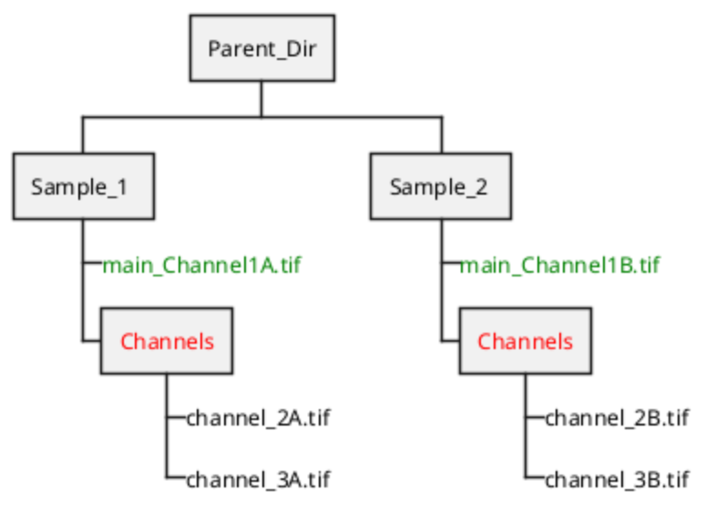

# Smooth Manifold based Maximum Intensity Projection

## Description:
Fiji/ImageJ Plugin for MIP-based Smooth Manifold Projection

## Plugin Interface Preview:
The interface may vary depending on the user's operating system.
Below is the interface when the plugin is used on Linux Mint 22.

## ImageJ Plugin instructions:
### Prerequisites and installation:
1. If Fiji is not installed, download and install a version, preferably bundled with JRE 1.8 (https://imagej.net/software/fiji/).
   If you already have Fiji installed, ensure it uses Java 1.8 or later.
2. Download the [SMP_based_Max.zip](https://github.com/AnhMinhDo/SMPBasedMax/releases/download/v0.1.1-beta/SMP_based_Max.zip) file 
3. Place the .jar file in the "plugins" folder of your Fiji installation
4. Open Fiji
### Usage:
1. From Plugins menu in Fiji, choose SMP_based_Max; The plugin dialog  will be displayed
2. Choose SINGLE_FILE Mode for single .tiff file processing, MULTIPLE_FILES Mode for batch processing or Interactive for tuning parameters
3. click browse button at "File path for SINGLE FILE" to choose the targeted file or "Directory for MULTIPLE FILES" to choose directory containing targeted .tiff files.
4. Adjust the parameters (direction of the stack, stiffness, filter size, offset, depth(optional))
5. click OK  to start the projection process
6. Output folder(s) is created at the same directory of the input .tiff file(s)
7. Output includes: Maximum Intensity projected Image(MIP), MIP corresponding z_map, Smooth Manifold MIP-based projected image(SMP), SMP corresponding z_map; if depth parameter is not 0, SMP-adjusted projected image and corresponding z_map
## Features:
### Process Mode:
**Single File**: Process only 1 file or 1 file with additional channels
**Multiple Files**: Process multiple files or multiple files with respective additional channels for the same parameter set
**Interactive**: used for parameter tuning, processed Image is shown in new window and updated when parameters are adjust the result are not saved; this is to ensure fast process and update.
### Direction of Z-Stack:
The Z-stack slices are ordered based on the Z-position in the 3D space.
**IN**: Top-to-Bottom: When the slices are taken from the top of the sample to the bottom, the Z-stack increases in value as you go deeper.
**OUT**: When the slices are taken from the bottom of the sample to the top.
### Stiffness:
This is the constraint for the minimum distance between consecutive peaks.
In the Smooth manifold process, signal peak is selected based on the distance with the nearest neighbor peaks.
High intensity peaks have higher priority.
The higher the stiffness, the fewer peaks are selected; result in less noisy projected image but also fewer details.
### Filter Size:
Filter size for Gaussian smoothing filters to reduce noise after the raw smoothing process.
### Offset:
Number to slices counting from the current smp slice to be performed MIP.
The higher the offset, the more detail from neighboring slice is capture.
This parameter is needed to be tuned for optimal result.
### Depth:
Number of steps to be moved after applied offset; used to move the projected image up the surface or deep in the sample
### Directory for MULTIPLE FILES:
Choose the directory for MULTIPLE_FILE MODE
### File path for SINGLE FILE:
Choose the file path for SINGLE_FILE MODE
### Project Additional channels:
Tick this if the smp z-map is used to applied for other channels of the same sample or image with the exact same dimension of the main channel.
**IMPORTANT**: Additional channel images must be in a "Channels" folder (the folder with the exact name "Channels"), located alongside the main channel image.  
### Additional channel directory:
SINGLE_FILE and Additional channels: specify the sample folder

MULTIPLE_FILES and Additional channels: specify the parent folder(the folder contains multiple sample Folders)

## License:
This project is licensed under the GNU General Public License v3.0. See the [LICENSE](https://github.com/AnhMinhDo/SMPBasedMax/blob/main/LICENSE.txt) file for more details.

