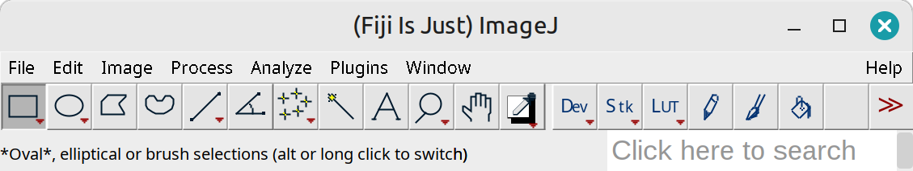
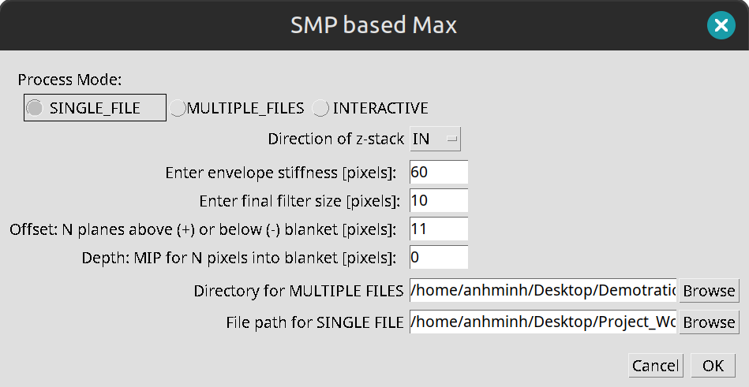

# Smooth Manifold based Maximum Intensity Projection

## Description:
Fiji/ImageJ Plugin for MIP-based Smooth Manifold Projection

## Plugin Interface Preview:
The interface may vary depending on the user's operating system.
Below is the interface when the plugin is used on Linux Mint 22.

## ImageJ Plugin instructions:
### Prerequisites and installation:
1. If Fiji is not installed, download and install a version, preferably bundled with JRE 1.8 (https://imagej.net/software/fiji/).
   If you already have Fiji installed, ensure it uses Java 1.8 or later.
2. Download the [SMP_based_Max.zip](https://github.com/AnhMinhDo/SMPBasedMax/releases/download/v0.1.1-beta/SMP_based_Max.zip) file 
3. Place the .jar file in the "plugins" folder of your Fiji installation
4. Open Fiji
### Usage:
1. From Plugins menu in Fiji, choose SMP_based_Max; The plugin dialog  will be displayed
2. Choose SINGLE_FILE Mode for single .tiff file processing, MULTIPLE_FILES Mode for batch processing or Interactive for tuning parameters
3. click browse button at "File path for SINGLE FILE" to choose the targeted file or "Directory for MULTIPLE FILES" to choose directory containing targeted .tiff files.
4. Adjust the parameters (direction of the stack, stiffness, filter size, offset, depth(optional))
5. click OK  to start the projection process
6. Output folder(s) is created at the same directory of the input .tiff file(s)
7. Output includes: Maximum Intensity projected Image(MIP), MIP corresponding z_map, Smooth Manifold MIP-based projected image(SMP), SMP corresponding z_map; if depth parameter is not 0, SMP-adjusted projected image and corresponding z_map
## Features:

## License:
This project is licensed under the GNU General Public License v3.0. See the [LICENSE](https://github.com/AnhMinhDo/SMPBasedMax/blob/main/LICENSE.txt) file for more details.

